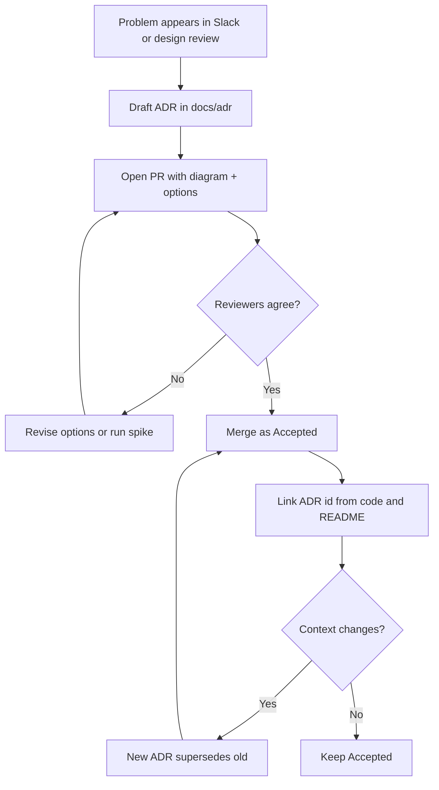

## The Question That Always Comes Back

Six months later someone asks: “Why did we put the embedding job on a queue instead of calling the model inline?” If the answer lives in a Slack thread from a Tuesday that three people have left, you do not have an architecture — you have folklore.

As an Assistant Solution Architect, capturing **why** is half my job. Diagrams show structure. Architecture Decision Records (ADRs) show intent. Together they keep AI and backend systems navigable when the original authors move on.


> An ADR is a justified software design choice recorded so the future team can understand the decision without reconstructing a meeting.

That idea is older than the current AI wave. Markdown ADRs (MADR-style) simply make it cheap enough that teams actually write them.

## Why Git Beats Wiki-Only Docs

I still use wikis for narratives and onboarding. Decisions go in the repo:

- They version with the code that depends on them
- They get reviewed in pull requests like any other change
- They are plain text — searchable, diffable, and readable by humans and tools
- Superseding a decision is explicit: new ADR references the old one; you do not silently rewrite history



## The Template I Actually Use

I keep the template short enough that people finish it. Long templates become abandoned templates.

```markdown
# ADR-003: Queue LLM calls behind a worker

- Status: Accepted
- Date: 2026-04-12
- Deciders: ASA, Solution Architect, Backend lead

## Context

Chat turns must stay responsive. Direct provider calls timed out under load in the spike
and blocked the NestJS request thread pool during retries.

## Decision

Accept user messages synchronously, enqueue model work, stream tokens from the worker
via WebSocket when ready.

## Options considered

1. Sync provider call in API process — rejected (latency + blast radius)
2. Queue + worker — accepted
3. Edge function per turn — rejected (ops complexity for our team size)

## Consequences

- Need idempotent job keys and dead-letter handling
- UI must show an explicit “working” state
- Cost becomes easier to throttle per tenant
```

Status values I stick to: **Proposed**, **Accepted**, **Deprecated**, **Superseded**. If everything is “living document,” nothing is a decision.

## Reviewing ADRs Like Code

An ADR PR is not a rubber stamp. Reviewers should attack:

1. **Are the options real alternatives at the same abstraction level?** (Do not compare “PostgreSQL” to “use a queue.”)
2. **Are consequences honest about pain?** Every accepted option creates work.
3. **Is the owner clear?** Who can change this later?
4. **Does a diagram belong here?** Many ADRs need a sequence or context sketch.

I reject ADRs that only document the winner. Without losers, you cannot trust the rationale.

## Linking Code Back to Decisions

When a module exists *because* of an ADR, say so at the boundary. Future refactors then know which document to reopen.

```typescript
/**
 * LLM job publisher — see ADR-003 (queue LLM calls behind a worker).
 * Do not call the provider from request handlers.
 */
@Injectable()
export class LlmJobPublisher {
  constructor(private readonly queue: QueueService) {}

  async enqueueTurn(input: { tenantId: string; conversationId: string; messageId: string }) {
    const jobId = `${input.tenantId}:${input.messageId}`;
    await this.queue.publish('llm.turn', { ...input, jobId }, { jobId });
    return { accepted: true, jobId };
  }
}
```

A one-line comment is enough. Do not paste the whole ADR into the source file.

## ADRs for AI Systems Need Extra Fields

Traditional ADRs cover databases and API styles. AI paths add decisions that carry product and risk weight:

- Which data may leave the VPC to a model provider?
- How are prompts and retrieval configs versioned?
- What output filters or refusal policies are in force?
- What is logged, redacted, and retained?

I add a short **Risk & compliance notes** section when those apply. It is still one decision per ADR — do not turn ADR-007 into a policy manual.

## Anti-Patterns I Keep Seeing

**The novel.** If it needs a table of contents, split it into an RFC then a thin ADR for the final call.

**The status-less page.** Without Accepted/Superseded, people treat every doc as optional opinion.

**The Confluence mirror.** Copying ADRs to a wiki “for visibility” is fine; making the wiki the source of truth is how drift starts.

**The silent rewrite.** Editing an Accepted ADR to match today’s code destroys trust. Supersede instead.

## A Minimal Folder Layout

```text
docs/
  adr/
    0000-template.md
    0001-language-and-runtime.md
    0002-primary-datastore.md
    0003-queue-llm-calls.md
  architecture/
    northline-assist-context.md
```

Numbered files sort. The template stays first. README links to the three ADRs every new hire must read before they touch the chat path.

## How This Changed My Week

Before ADRs, I repeated the same explanations in three meetings. After ADRs, I paste a link. Design reviews start from shared context. When the Solution Architect asks for options, I already have structured losers and winners.

ADRs do not slow teams down. Re-litigating settled decisions does.

## Related on This Site

Pair this with [C4 Diagrams for the Right Audience](/blog/c4-diagrams-for-the-right-audience) and [How I Run Architecture Design Reviews](/blog/how-i-run-architecture-design-reviews). For the communication choice that shows up in half our ADRs, see [Microservices Communication: Sync vs Async](/blog/microservices-communication-patterns).

Write the why while you still remember it. Future you is a stakeholder too.
