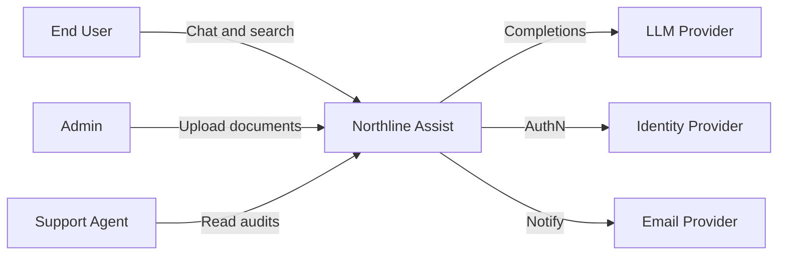
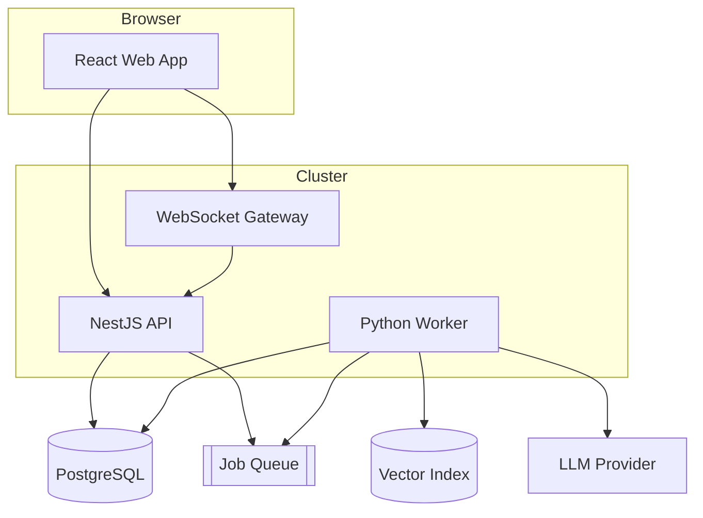

## One Diagram Cannot Serve Everyone

I used to drop a single mega-diagram into every meeting. Product squinted at Redis boxes. Developers asked where the domain logic lived. DevOps asked about deploy units and got a class diagram instead.

The C4 model fixed that habit. Simon Brown’s idea is simple: architecture needs **zoom levels**, like a map. Context is the city. Containers are the neighborhoods. Components are the streets. Show the wrong zoom and people get lost even when the drawing is “correct.”


> Diagrams should answer a specific question for a specific audience — not prove that you can draw every box in the system.

## The Four Zooms I Use in Practice

| Level | Question it answers | Primary audience |
| --- | --- | --- |
| Context | Who uses the system and what does it talk to? | Product, leadership, new joiners |
| Container | What are the deployable apps, data stores, queues? | DevOps, platform, architects |
| Component | What are the major modules inside one container? | Developers owning that service |
| Code | Classes and functions | Rarely drawn; prefer the IDE |

I almost never draw Code-level diagrams for reviews. They rot immediately. Components are enough when a service is genuinely complex.

## Context: Northline Assist (Fictional)

Imagine an AI assistant that answers questions over a company’s uploaded documents. Users chat in a web app. The system calls an external LLM provider. Admins upload files. Support reads audit logs.



Product cares that Support is in the picture. Compliance cares that the LLM is external. Nobody needs NestJS module names yet.

## Container: What We Actually Deploy

Same system, one zoom in. Now DevOps can talk about scaling and secrets.



This is where we decide: is the worker a separate deployable? Does the API ever call the LLM directly? (In our ADR-003 world, no.)

## Matching Audience to Artifact

**Product workshop:** Context only, plus a one-paragraph user journey. If they ask “can we add Slack?”, you update people and external systems — not Redis.

**DevOps / platform:** Container diagram plus NFRs (RPO/RTO, regions, secrets). They will ask about the queue and the database long before they ask about Controllers.

**Developer deep dive:** Component diagram for *one* container. Example: inside the NestJS API — auth, conversations, documents, admin, audit.

```typescript
type C4Audience = 'product' | 'devops' | 'developers';

function diagramFor(audience: C4Audience): 'context' | 'container' | 'component' {
  switch (audience) {
    case 'product':
      return 'context';
    case 'devops':
      return 'container';
    case 'developers':
      return 'component';
  }
}

// Wrong zoom is a facilitation bug, not an aesthetics bug.
const reviewDeck = {
  stakeholders: ['product', 'devops'] as C4Audience[],
  diagrams: (['product', 'devops'] as C4Audience[]).map(diagramFor),
};
```

## How I Keep Diagrams From Rotting

1. **Store them as Mermaid (or Structurizr DSL) in git** next to ADRs
2. **Update the diagram in the same PR** that changes the topology
3. **Link ADRs ↔ diagrams** (“see container view in `northline-assist-containers.md`”)
4. **Delete detail** that no longer earns its ink

Architecture-as-code works because plain text diagrams review like code. PNG exports in Drive do not.

## Common Mistakes

**Mixing zooms.** A context diagram with “AuthModule” and “Redis” is neither useful nor C4.

**Technology soup without relationships.** Boxes without labeled arrows are clip art.

**One eternal master diagram.** Prefer a small set of living views over a museum piece.

**Drawing components for every service.** Only zoom into hotspots. Stable CRUD services can stay as a single container box.

## A Facilitation Trick

At the start of a review I say out loud: “Today we are at container level. If we drift into class design, I will park it.” People relax. They know there will be another forum for the deep dive.

## Related on This Site

ADRs capture the why behind these views: [Architecture Decision Records in Git](/blog/architecture-decision-records-in-git). For AI-specific arrows between containers, see [Data Flow Diagrams for AI Backends](/blog/data-flow-diagrams-for-ai-backends). NestJS boundaries that often appear at component level are covered in [Building Scalable APIs with NestJS](/blog/building-scalable-apis-nestjs).

Pick the zoom. Name the audience. Then draw less — and communicate more.
