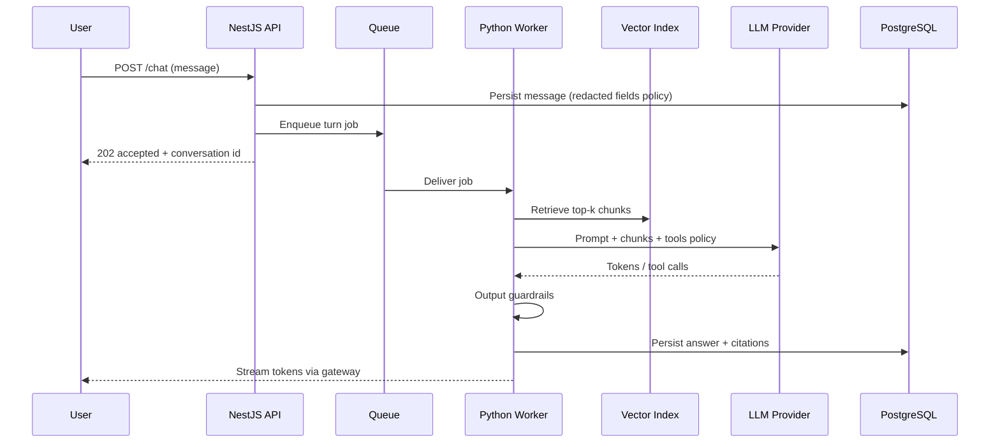
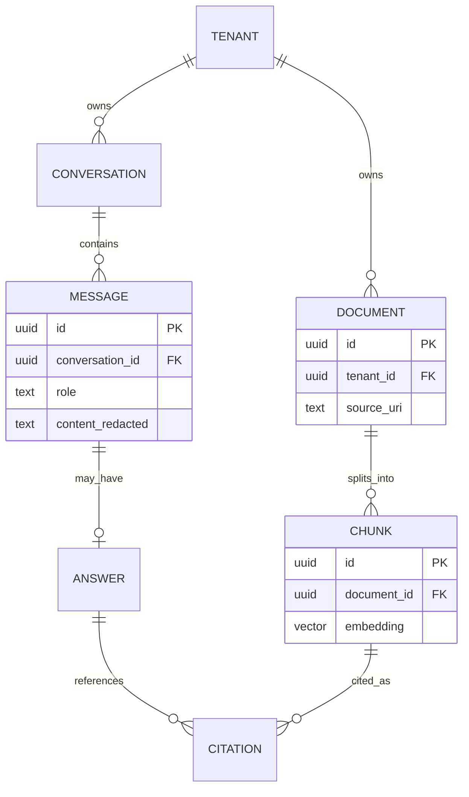

## Boxes Are Easy. Arrows Are the Architecture.

In AI products, people love component catalogs: vector DB, orchestrator, tool-calling agent, guardrail service. The failures I see in reviews almost never come from missing a trendy box. They come from unclear **data flow**: what leaves the trust boundary, what is stored, what is logged, and what the user waits on.

As Assistant Solution Architect, I treat data-flow diagrams as first-class artifacts — especially for RAG-style assistants.


> If you cannot say where personal data goes when the model is called, you do not have an AI architecture — you have a demo.

## The Canonical Path I Draw First

For a fictional product **Northline Assist**, a chat turn looks like this:



This one diagram answers half the design-review questions: sync vs async, where retrieval sits, when the provider is touched, and when persistence happens.

## What I Annotate on Every AI Flow

1. **Trust boundary** — VPC vs vendor
2. **PII classes** — none / soft identifiers / regulated
3. **Retention** — prompt logs, raw docs, embeddings
4. **User-visible latency** — time-to-accept vs time-to-first-token
5. **Failure modes** — provider timeout, empty retrieval, guardrail block

I literally label arrows: `HTTPS + tenant key`, `chunks without emails`, `log hash only`.

## A FastAPI-Shaped Worker Sketch

The API can be NestJS; the worker is often Python. The sketch below is intentionally generic — patterns, not a client codebase.

```python
from fastapi import FastAPI
from pydantic import BaseModel, Field

app = FastAPI()


class TurnJob(BaseModel):
    tenant_id: str
    conversation_id: str
    message_id: str
    query: str = Field(max_length=4000)


async def retrieve(tenant_id: str, query: str) -> list[str]:
    # Vector search scoped by tenant. Never cross tenants.
    ...


async def complete(prompt: str) -> str:
    # Provider call happens only here — not in the HTTP request path.
    ...


def guardrail(text: str) -> str:
    # Blocklist, PII scrub, policy checks.
    ...


@app.post("/internal/jobs/turn")
async def run_turn(job: TurnJob) -> dict[str, str]:
    chunks = await retrieve(job.tenant_id, job.query)
    prompt = build_prompt(job.query, chunks)
    raw = await complete(prompt)
    safe = guardrail(raw)
    await persist_answer(job, safe, citations=chunks)
    return {"status": "ok", "message_id": job.message_id}
```

The architectural rules encoded here: tenant scoping on retrieval, provider isolated behind the worker, guardrails before persist, bounded query size.

## Logging Without Creating a Second Data Breach

Teams log prompts “for debugging” and accidentally build a shadow PII store. My default stance:

- Log **message ids**, model name, token counts, latency, retrieval hit counts
- Hash or tokenize user content in logs unless a break-glass process exists
- Separate audit events (who asked what, for compliance) from debug traces
- Never log raw provider payloads in shared verbose mode by default

```typescript
type AiTraceEvent = {
  tenantId: string;
  conversationId: string;
  messageId: string;
  model: string;
  inputTokens: number;
  outputTokens: number;
  retrievalHits: number;
  latencyMs: number;
  // Intentionally no raw prompt or document text
};

function emitTrace(event: AiTraceEvent) {
  logger.info('ai.turn.completed', event);
}
```

If product needs full transcript search, that is a **product feature** with retention policy — not a side effect of `console.log`.

## ER View of What You Persist

Data flow should match the schema story:



When the ER and the sequence disagree, production will eventually invent a third truth.

## Review Checklist for AI Data Flows

- Can a tenant ever retrieve another tenant’s chunks?
- What happens on empty retrieval — refuse, search web, or answer from parametric memory?
- Are tool calls allowlisted?
- Is streaming failure visible in the UI state machine?
- Do we version the prompt template id with the stored answer?

## Related on This Site

Containers around this flow live in [C4 Diagrams for the Right Audience](/blog/c4-diagrams-for-the-right-audience). Cost of tokens along the arrows is covered in [NFRs, Effort, and Infrastructure Cost](/blog/nfrs-effort-and-infrastructure-cost). Broader automation context: [AI Automation Workflows with Python](/blog/ai-python-automation-workflows).

Draw the arrows until a new teammate can explain the path without a meeting. That is the bar.
