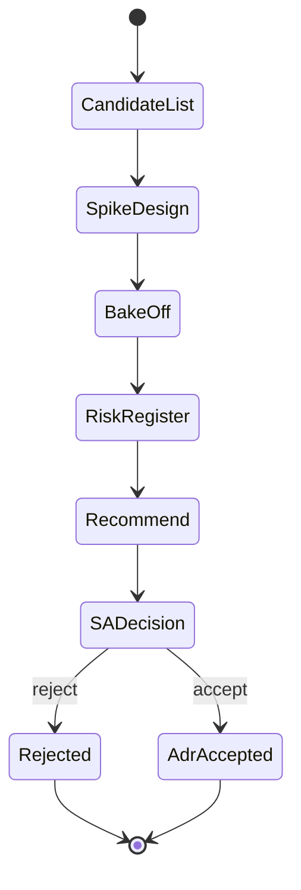

## Recommendations Beat Opinions

Vendors and frameworks arrive weekly in AI-heavy environments: a new vector database, a new gateway, a new “agent platform.” My job is not to chase novelty. It is to run **evaluations** that the Solution Architect can trust — evidence, risks, and a clear recommend/reject.

I decide small bets. I prepare large ones.


> Taste selects candidates. Spikes select winners. Governance selects what we can live with.

## What I Decide vs What I Escalate

| Decision type | Owner | Example |
| --- | --- | --- |
| Local pattern inside a service | ASA + service lead | Retry policy for one worker |
| Cross-service contract | ASA recommends, SA confirms | Event schema for document ingested |
| Vendor / compliance / multi-year bet | Solution Architect | Primary LLM vendor, data residency |
| Emergency mitigation | On-call + ASA advisory | Temporary feature flag disable |

Clarity here prevents both paralysis and cowboy architecture.

## Evaluation Lifecycle



I never jump from a conference talk to production. The bake-off is where marketing claims go to die.

## Designing a Fair Spike

A spike needs:

1. **Success criteria** written before coding (latency, cost, ops burden, team skill)
2. **Same workload** for each option
3. **Time box** (often 2–3 days)
4. **Honest failure** — stopping early is a valid result

```yaml
bake_off:
  subject: "Vector index for Northline Assist"
  workload:
    documents: 50_000
    avg_chunk_tokens: 400
    queries: 1_000
  criteria:
    - name: p95_query_ms
      target: 120
      weight: 0.35
    - name: reindex_minutes
      target: 30
      weight: 0.2
    - name: ops_complexity
      scale: 1-5
      weight: 0.25
    - name: monthly_cost_at_load
      weight: 0.2
  options:
    - pgvector_on_existing_postgres
    - managed_vector_service
  timebox_days: 3
```

If criteria appear after results, someone is rationalizing.

## The Recommendation Memo

I keep memos short enough that the Solution Architect can read them between meetings:

```markdown
## Recommendation: pgvector on existing Postgres (Phase 1)

### Why
Meets p95 on the bake-off workload, reuses ops knowledge, defers new vendor.

### Risks
Index bloat under heavy re-embed; need autovacuum playbook.

### When to revisit
Corpus > 5M chunks or multi-region active-active search.

### Rejected
Managed vector service — better scale story, higher ops + cost for current stage.
```

Then we cut an ADR. The memo is the pre-read; the ADR is the record.

## Risk Register Without Bureaucracy

I track risks as rows, not vibes:

```typescript
type Risk = {
  id: string;
  description: string;
  likelihood: 1 | 2 | 3 | 4 | 5;
  impact: 1 | 2 | 3 | 4 | 5;
  mitigation: string;
  owner: string;
};

function score(r: Risk) {
  return r.likelihood * r.impact;
}

const risks: Risk[] = [
  {
    id: 'R-12',
    description: 'Provider region outage blocks completions',
    likelihood: 2,
    impact: 5,
    mitigation: 'Queue + degrade to retrieval-only mode flag',
    owner: 'asa',
  },
  {
    id: 'R-18',
    description: 'Vector reindex blocks writes',
    likelihood: 3,
    impact: 3,
    mitigation: 'Blue/green index alias swap',
    owner: 'devtools',
  },
];

const ordered = [...risks].sort((a, b) => score(b) - score(a));
```

High scores must appear in the design review, not in a private doc.

## Assisting Without Undermining

I bring options and a recommendation. I do not ambush the Solution Architect in a public forum with a surprise “we already chose.” If evidence changes after their decision, I propose a superseding ADR — I do not quietly reverse course in a PR.

Loyalty to the system means loyalty to the decision process.

## Related on This Site

Where recommendations become ADRs: [Architecture Decision Records in Git](/blog/architecture-decision-records-in-git). Cost criteria: [NFRs, Effort, and Infrastructure Cost](/blog/nfrs-effort-and-infrastructure-cost). Role context: [From Engineer to Assistant Solution Architect](/blog/from-engineer-to-assistant-solution-architect). Ops reality checks: [Docker in Production: Beyond the Basics](/blog/docker-production-deployment).

Evaluate in the open. Decide with evidence. Support the Solution Architect by making the hard choice the clear choice.
