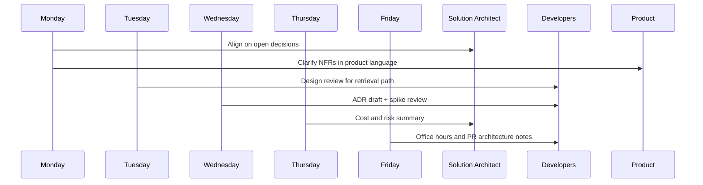

## The Title Changed. The Work Felt Different Overnight.

I spent years as a full-stack and backend engineer. Success was measurable: tickets closed, PRs merged, latency charts trending down. When I stepped into an Assistant Solution Architect role supporting a Solution Architect on AI-backed products, that scoreboard quietly disappeared.

Nobody asked me to write the feature anymore. They asked whether the feature belonged in this service, whether the data should leave the trust boundary, and what it would cost to run at 10× traffic. My job shifted from *building the path* to *making the path safe to build on*.


> The architect’s job is not to have all the answers — it is to make the right questions impossible to skip.

That line sits on a sticky note above my monitor. It is the shortest description of the role I have found.

## What I Still Own vs What I Influence

As an engineer I owned code paths. As an Assistant Solution Architect I own **artifacts and decisions**:

- Architecture and data-flow diagrams that product, DevOps, and developers can all read
- Design reviews before irreversible choices land in production
- Guidance for developers who are mid-implementation and need a constraint, not a lecture
- Effort, infrastructure, and cost estimates that business can act on
- Technology evaluations and spike summaries for the Solution Architect

I still write code — usually spikes, reference implementations, and proof that a pattern works. I do not try to be the busiest committer on the team. If I am, something about the system of work is broken.

## A Typical Week (Not a Fantasy Calendar)

Here is how a real week often flows when we are shaping a new AI-assisted workflow product I will call **Northline Assist** — a fictional internal name for a chat-driven assistant over company documents. No client specifics; the shape will look familiar if you work on RAG or agentic backends.



### Monday — Align Before You Draw

I start by listing decisions that are still living only in Slack. Anything older than a week without an owner becomes a candidate for an Architecture Decision Record. I sync with the Solution Architect on which decisions are theirs to close and which I can drive to a recommendation.

### Tuesday — Design Review

One service wants to call the LLM vendor synchronously from the request path. Another wants a queue and a worker. We review both with the same checklist: latency budget, failure modes, cost at projected QPS, and what the user sees when the model times out.

### Wednesday — Write the Decision Down

I draft the ADR, attach a Mermaid data-flow diagram, and open a PR against `docs/adr/`. The review is the point — not the prose. Developers comment on consequences; DevOps comments on ops burden; product comments on user-visible failure.

### Thursday — Numbers

I turn the preferred option into effort and infra cost ranges. Not a single magical number — a range with assumptions. “If we cache embeddings and reuse sessions, token cost stays under X; if every turn re-embeds the full corpus slice, we blow the budget by week three.”

### Friday — Unblock People

Office hours. Short pairing on a NestJS module boundary. A comment on a PR that says “this violates ADR-003; either update the ADR or split the concern.” Then I write down what I learned so next Friday’s questions are shorter.

## The Skills That Transfer (and the Ones That Surprise You)

**Transfers well:** API design, database trade-offs, observability instincts, knowing when sync HTTP is a distributed monolith waiting to happen. My earlier work on NestJS services, PostgreSQL schemas, and event-driven flows still pays rent every day.

**Surprises you:** Soft power. You rarely “assign” work. You create clarity so the right work becomes obvious. You also learn to say “I don’t know yet — here is the spike” without losing credibility.

**Must grow fast:** Facilitation. A design review that turns into a debate about taste wastes eight people’s hour. A review with a written agenda and an explicit decision/parking-lot split ends on time with an owner.

## How I Think About AI Systems Without Overfitting to Hype

Working near AI products does not mean every diagram needs twelve agent boxes. Most of the hard problems are still systems problems:

- Where does PII enter and leave the pipeline?
- What is synchronous for the user vs async for the worker?
- How do we version prompts and retrieval configs like any other config?
- What is the rollback when a model provider degrades?

```typescript
type ArchitectureQuestion = {
  decision: string;
  userVisibleImpact: string;
  failureMode: string;
  costDriver: 'tokens' | 'cpu' | 'storage' | 'ops';
  owner: 'asa' | 'sa' | 'team';
};

const northlineAssistQuestions: ArchitectureQuestion[] = [
  {
    decision: 'Sync LLM call on chat turn vs queue + worker',
    userVisibleImpact: 'Time-to-first-token vs “thinking” state',
    failureMode: 'Provider timeout leaves orphaned UI state',
    costDriver: 'tokens',
    owner: 'asa',
  },
  {
    decision: 'Shared Postgres vs dedicated vector store',
    userVisibleImpact: 'Search quality and cold-start latency',
    failureMode: 'Index drift after document updates',
    costDriver: 'storage',
    owner: 'sa',
  },
];
```

I keep a list like this in every initiative. If a question has no owner, it will be answered accidentally in a Friday hotfix.

## What “Supporting the Solution Architect” Means Day to Day

I am not a junior title with architecture cosplay. The Solution Architect owns the largest bets: multi-team contracts, vendor strategy, compliance posture. I own the preparation: options, diagrams, trade-off tables, spike results, and a clear recommendation.

When I bring a recommendation, I bring the losers too. “We rejected Option B because cold-start retrieval exceeded the p95 budget in the spike” is more useful than “Option A feels cleaner.”

## Mistakes I Made in the First Month

1. **Drawing too much, deciding too little.** Beautiful diagrams without a decision status confuse more than they help.
2. **Answering every developer question live.** I became a human FAQ. ADRs and a weekly architecture office hour fixed most of that.
3. **Estimating in story points only.** Architecture work needs calendar time, risk, and infra cost — not just Fibonacci theater.
4. **Skipping product language.** Saying “p95 under 800ms with circuit breaker” means nothing until you translate it to “the assistant answers in under a second or shows a clear retry.”

## A Practical Checklist If You Are Making the Same Move

- Keep shipping small spikes so your diagrams stay honest
- Put decisions in git, not only in meetings
- Separate *advice* (office hours) from *authority* (ADRs / SA decisions)
- Measure your week by unblocked teams and closed decisions, not LOC
- Protect deep-work blocks for reading designs; context-switching kills architectural judgment

## Related on This Site

If you want the artifact side of this role next, read [Architecture Decision Records in Git](/blog/architecture-decision-records-in-git) and [C4 Diagrams for the Right Audience](/blog/c4-diagrams-for-the-right-audience). For the communication patterns that still show up in every review, [Microservices Communication: Sync vs Async](/blog/microservices-communication-patterns) remains relevant.

The title on LinkedIn changed in a day. The craft takes longer. I am still learning when to draw, when to decide, and when to get out of the developers’ way — and that tension is the job.
