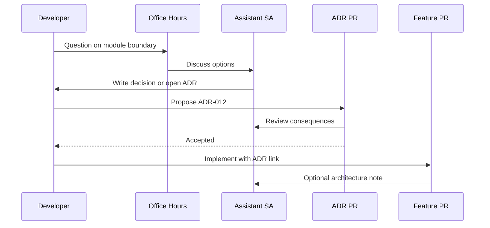

## Helpfulness Can Become a Single Point of Failure

Early in the role I answered every architecture question the moment it appeared. Developers loved the speed. Throughput collapsed whenever I was in back-to-back reviews. I had become the architecture bus — and buses have limited seats.

The fix was not “be less helpful.” It was to put guidance into **artifacts and rituals** so most answers do not need me in the room.


> If every decision requires your presence, you are not scaling architecture — you are rationing it.

## Three Channels, Three Speeds

| Channel | When to use | Speed | Artifact |
| --- | --- | --- | --- |
| Office hours | Ambiguous, local questions | Same day | Notes / ticket comment |
| ADR | Cross-cutting decision | Days | `docs/adr/*` PR |
| RFC | Large change needing debate | Week+ | RFC then ADR |

I publish the rules. Developers stop guessing which door to knock on.



## Office Hours That Actually Work

I run a fixed weekly window and a short daily async slot for blockers. Rules:

- Bring a diagram or a failing assumption — not “quick thought?”
- Decisions that affect more than one service leave as ADR drafts
- I pair for spikes; I do not pair for routine CRUD

Pairing is expensive. I use it when the cost of being wrong is high or when a developer is new to a subsystem.

## When I Write the Spike Myself

Sometimes the fastest way to guide is to produce a thin vertical slice: a NestJS module skeleton, a worker contract, a failing test that encodes the NFR. I hand it over with explicit “replace me” comments.

```typescript
/**
 * Spike only — validates ADR-003 queue contract.
 * Replace FakeLlmProvider before production.
 */
export class TurnWorkerSpike {
  constructor(
    private readonly queue: QueueService,
    private readonly llm: FakeLlmProvider,
  ) {}

  async handle(job: { messageId: string; prompt: string }) {
    const result = await this.llm.complete(job.prompt);
    await this.queue.ack(job.messageId);
    return result;
  }
}
```

The spike teaches the pattern without blocking the team on my calendar for every file.

## PR Comments Without Becoming Gatekeeper

I do not approve every PR. I subscribe to paths that touch trust boundaries, public APIs, and anything marked in ADRs as constrained. My comments cite the ADR id. If we disagree with the ADR, we change the ADR — we do not special-case the PR.

## Measuring Whether I Am a Bottleneck

Signals I watch:

- How many PRs wait on my review &gt; 24h
- How often the same question repeats in office hours
- Whether ADRs are authored by others, not only by me
- Whether teams ship thin verticals without scheduling me first

If ADRs are only written by the ASA, the culture is not healthy yet.

## Related on This Site

The review ritual: [How I Run Architecture Design Reviews](/blog/how-i-run-architecture-design-reviews). The decision store: [Architecture Decision Records in Git](/blog/architecture-decision-records-in-git). Stakeholder translation that reduces drive-by questions: [Working With Product, DevOps, and Business](/blog/working-with-product-devops-and-business).

Guide with systems. Show up for the hard edges. Leave the rest to the team’s growing judgment.
