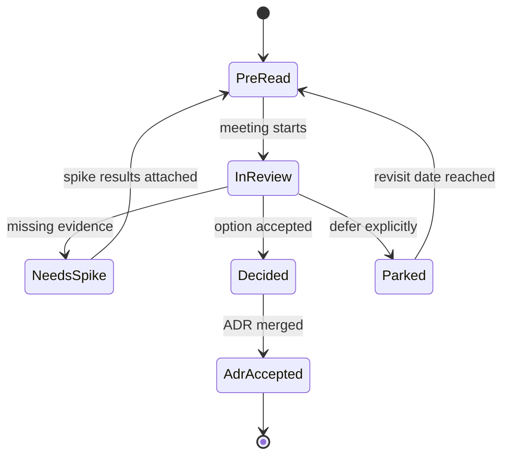

## Reviews Fail When They Are Debates Without a Clock

I have sat in “architecture reviews” that were really opinion arenas. The loudest voice won. No decision was written down. Two weeks later the same debate returned wearing a new Jira ticket.

As Assistant Solution Architect, my job in a design review is facilitation plus judgment: make the risks visible, force a decision or an explicit deferral, and leave an artifact the team can execute against.


> Review the design, not the designer. Curiosity scales; ego does not.

## The Pipeline Before Anyone Joins a Call

I refuse meetings without a pre-read. Thirty minutes of reading beats sixty minutes of discovery theater.

**Minimum pre-read package:**

1. Problem statement in one paragraph
2. Context or container diagram
3. Options (at least two real ones)
4. Preferred option and why
5. Open questions and risks
6. Draft ADR status: Proposed

```yaml
design_review:
  title: "Northline Assist — retrieval path"
  duration_min: 45
  required_roles:
    - assistant_solution_architect
    - solution_architect_optional
    - service_owners
    - devops_on_call_path
  pre_read_hours: 24
  outcomes:
    - decision
    - parking_lot
    - follow_up_spike
  decision_rule: "ASA recommends; SA closes multi-team bets"
```

If the author cannot produce options, the meeting is a pairing session — schedule it as one. Do not invite eight people to watch a blank whiteboard.

## States of a Review



Every item in the room must land in **Decided**, **NeedsSpike**, or **Parked** with an owner and date. “We talked about it” is not a state.

## Questions I Always Ask

These are not gotchas. They are load-bearing:

- What does the user see when the dependency fails?
- What is the p95 latency budget and who measured it?
- Which data crosses a trust boundary?
- What is the rollback if we ship this on Tuesday?
- Which ADR does this change, or which new ADR do we need?
- What did we explicitly reject and why?

For AI paths I add: prompt/config versioning, logging redaction, and cost at projected concurrency.

## Facilitating Without Becoming the Bottleneck

I timebox. I write the decision live in the ADR draft during the call so people leave having seen the words. I park taste debates (“I prefer GraphQL”) unless they change constraints.

When conflict appears, I restate the **decision drivers** out loud: latency, cost, team skill, compliance, time-to-market. Arguments that do not map to a driver get parked politely.

```typescript
type ReviewItemStatus = 'decided' | 'needs_spike' | 'parked';

type ReviewItem = {
  topic: string;
  status: ReviewItemStatus;
  owner: string;
  dueDate?: string;
  adrId?: string;
};

function summarize(items: ReviewItem[]): Record<ReviewItemStatus, number> {
  return items.reduce(
    (acc, item) => {
      acc[item.status] += 1;
      return acc;
    },
    { decided: 0, needs_spike: 0, parked: 0 },
  );
}

const endOfMeeting = summarize([
  { topic: 'Queue LLM work', status: 'decided', owner: 'asa', adrId: 'ADR-003' },
  { topic: 'Vector DB vendor', status: 'needs_spike', owner: 'dev-lead', dueDate: '2026-05-29' },
  { topic: 'Slack connector', status: 'parked', owner: 'product', dueDate: '2026-Q3' },
]);
```

If `decided` is zero at minute 45, the review failed — even if everyone “felt aligned.”

## Psychological Safety Is a Delivery Feature

People stop bringing designs early if reviews feel like trials. I start by thanking the author for writing options. I ask clarifying questions before critiques. I invite the quietest service owner to speak before the loudest.

I also model changing my mind when evidence appears. An Assistant Solution Architect who never updates a recommendation teaches the team to hide data.

## After the Meeting

Within a day:

1. Update the ADR PR with the decision text
2. File spike tickets with acceptance criteria
3. Post a short summary link in the team channel
4. Add follow-ups to the architecture board with dates

No summary means the meeting was entertainment.

## Anti-Patterns

- Reviewing code line-by-line in an architecture forum
- Inviting the whole company “for visibility”
- Accepting “we’ll figure out ops later”
- Letting the SA skip the room and reverse the decision silently later without superseding the ADR

## Related on This Site

Decisions should land in [Architecture Decision Records in Git](/blog/architecture-decision-records-in-git). Diagrams for the pre-read come from [C4 Diagrams for the Right Audience](/blog/c4-diagrams-for-the-right-audience). When reviews turn into mentoring, [Guiding Developers Without Being a Bottleneck](/blog/guiding-developers-without-being-a-bottleneck) is the companion piece.

A good design review feels slightly uncomfortable and ends clearly. That discomfort is risk leaving the shadows.
