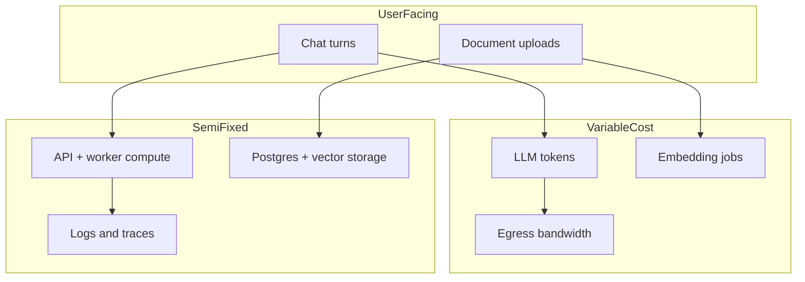

## Architecture Without Numbers Is Just Opinion

A design can be elegant and still be wrong for the business. As Assistant Solution Architect, part of my job is translating options into **non-functional requirements**, engineering effort, and infrastructure cost — especially when every chat turn burns tokens.

I do not pretend estimates are prophecy. I make assumptions visible so decisions can change when reality disagrees.


> If the cost driver is invisible in the design review, it will become visible on the invoice.

## Start With NFRs People Can Test

I push for measurable targets:

| NFR | Example target | How we verify |
| --- | --- | --- |
| Latency | p95 time-to-first-token &lt; 2.5s | Load test + prod SLOs |
| Availability | 99.9% for chat accept API | Error budget policy |
| Durability | No lost accepted messages | Queue + outbox checks |
| Cost | &lt; $X per 1k successful turns | FinOps dashboard |
| Safety | Guardrail block rate monitored | Weekly review |

Vague NFRs like “fast” and “cheap” create silent conflict between product and engineering.

## Cost Drivers for an AI Backend



For many assistants, **tokens dominate** once usage grows. Caching retrieval, shortening prompts, and avoiding re-embedding unchanged docs often beat shaving a few dollars of idle compute.

## A Small Cost Model I Keep Honest

```typescript
type CostAssumptions = {
  turnsPerDay: number;
  avgInputTokens: number;
  avgOutputTokens: number;
  inputPricePer1M: number;
  outputPricePer1M: number;
  embedDocsPerDay: number;
  avgEmbedTokens: number;
  embedPricePer1M: number;
  workerHoursPerDay: number;
  workerHourly: number;
};

function estimateMonthlyUsd(a: CostAssumptions): number {
  const chatTokensIn = a.turnsPerDay * a.avgInputTokens * 30;
  const chatTokensOut = a.turnsPerDay * a.avgOutputTokens * 30;
  const embedTokens = a.embedDocsPerDay * a.avgEmbedTokens * 30;

  const llm =
    (chatTokensIn / 1_000_000) * a.inputPricePer1M +
    (chatTokensOut / 1_000_000) * a.outputPricePer1M +
    (embedTokens / 1_000_000) * a.embedPricePer1M;

  const compute = a.workerHoursPerDay * a.workerHourly * 30;
  return Number((llm + compute).toFixed(2));
}

const baseline = estimateMonthlyUsd({
  turnsPerDay: 5000,
  avgInputTokens: 1800,
  avgOutputTokens: 400,
  inputPricePer1M: 0.5,
  outputPricePer1M: 1.5,
  embedDocsPerDay: 200,
  avgEmbedTokens: 1200,
  embedPricePer1M: 0.1,
  workerHoursPerDay: 48,
  workerHourly: 0.08,
});
```

I run **optimistic / expected / pessimistic** rows by changing turns and token sizes. The delta between rows is often more useful than the absolute number.

## Effort Estimation Without Story-Point Theater

For architecture-shaped work I estimate in calendar ranges plus risk:

1. **Spike** — 1–3 days to kill an option
2. **Thin vertical** — first production-safe path
3. **Hardening** — retries, DLQ, dashboards, runbooks
4. **Multi-team contract** — if another squad must change APIs

I call out what is *not* in the estimate: content migration, prompt redesign after user testing, vendor procurement time.

## How I Present Options to Business

Same three options, three columns: user impact, eng weeks, monthly run cost at expected load, key risk. I avoid dumping Mermaid on executives; I keep the diagram for engineering and a table for leadership.

When the Solution Architect owns the final call, my job is to make the trade-off impossible to misunderstand.

## Mistakes That Inflate or Hide Cost

- Counting only happy-path tokens (retries double spend)
- Ignoring embedding churn when documents update hourly
- Treating logs as free (high-cardinality prompt logs are not)
- Estimating engineering as if DevOps automation already exists

## Related on This Site

Data-flow arrows that drive token cost: [Data Flow Diagrams for AI Backends](/blog/data-flow-diagrams-for-ai-backends). Review forums where NFRs get decided: [How I Run Architecture Design Reviews](/blog/how-i-run-architecture-design-reviews). For Postgres performance that shows up in the semi-fixed layer, [PostgreSQL Query Optimization in Practice](/blog/postgresql-query-optimization).

Make the invoice visible in the design. That is architectural honesty.
