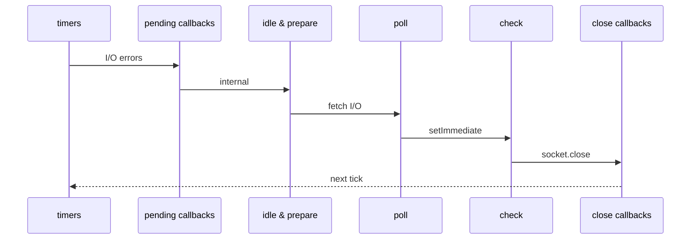

## Why This Matters for Backend Developers

Node.js runs on a single thread. Every request your API handles shares that same thread. When you block it — even for 50ms — every other in-flight request stalls. Understanding the event loop is not academic; it's the difference between an API that handles 10,000 req/s and one that handles 100.

## The Loop in Five Phases

The event loop cycles through these phases on every tick:



The poll phase is where your app spends most of its time waiting for I/O. When a database query or HTTP request completes, its callback queues here.

## What Blocks the Loop

```typescript
// This blocks for ~200ms. Every concurrent request waits.
function processLargeDataset(data: Record<string, unknown>[]) {
  return data.map(item => heavyTransformation(item)); // synchronous, no await
}

// This is fine — the loop is free while DB query runs
async function processLargeDataset(data: Record<string, unknown>[]) {
  const result = await db.query('SELECT * FROM processed_data WHERE id = ANY($1)', [ids]);
  return result.rows;
}
```

The key distinction: I/O operations (database, filesystem, HTTP) are handled by libuv's thread pool and don't block the event loop. CPU-bound operations (JSON parsing of huge payloads, image processing, complex computation) do block it.

## Microtasks vs Macrotasks

Execution order trips up even experienced Node.js developers:

```typescript
console.log('1');

setTimeout(() => console.log('2'), 0);

Promise.resolve().then(() => console.log('3'));

process.nextTick(() => console.log('4'));

console.log('5');

// Output: 1, 5, 4, 3, 2
```

`process.nextTick` runs before any I/O, before promises, before `setTimeout`. Promises (microtasks) drain completely before the event loop advances to the next phase. `setTimeout(fn, 0)` runs in the timers phase, after the current poll phase completes.

## Offloading CPU Work

For genuinely CPU-bound work, use worker threads:

```typescript
import { Worker, isMainThread, parentPort, workerData } from 'worker_threads';

if (isMainThread) {
  function runWorker(data: unknown): Promise<unknown> {
    return new Promise((resolve, reject) => {
      const worker = new Worker(__filename, { workerData: data });
      worker.on('message', resolve);
      worker.on('error', reject);
    });
  }

  app.post('/process', async (req, res) => {
    const result = await runWorker(req.body.data);
    res.json(result);
  });
} else {
  const result = heavyCpuWork(workerData);
  parentPort?.postMessage(result);
}
```

The worker runs on a separate OS thread. The main event loop stays free to handle other requests.

## The Practical Rule

Async/await does not make code non-blocking. `await someAsyncFn()` yields the event loop only when `someAsyncFn` actually does I/O. A function that does 500ms of pure computation and returns a promise is still blocking — you're just awaiting a blocking value.

If it touches the network or disk, it's safe. If it runs JavaScript, it occupies the loop.
