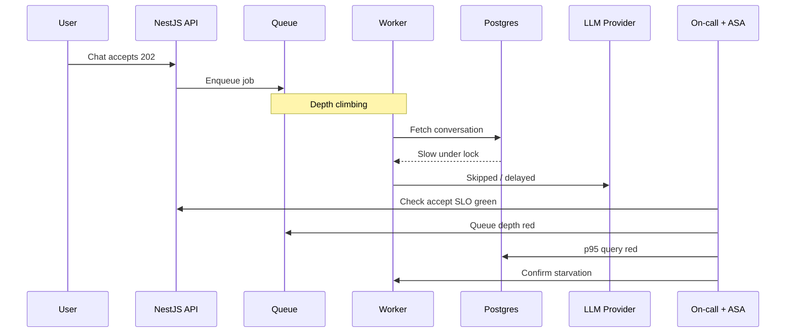

## Symptoms Lie About the Culprit

A spike in “AI is slow” tickets can be a saturated worker pool, a Postgres lock, a vector index rebuild, a provider blip, or a frontend that never stops polling. As Assistant Solution Architect, I am often pulled into incidents not to restart pods first, but to **narrow the blast radius of the investigation**.

The skill looks like debugging. The posture looks like architecture: boundaries, contracts, and observability designed before the fire.


> Correlate first, hypothesize second. Instinct without IDs is storytelling.

## A Typical Incident Path

Fictional **Northline Assist**: users report answers never arriving. Accept API looks healthy.



The architecture review question afterward is not “who messed up” — it is “which signal was missing so we spent forty minutes on the LLM dashboard.”

## Correlation IDs Are Non-Negotiable

Every accept path must mint or forward a correlation id into queue payloads, worker logs, and provider traces.

```typescript
import { CallHandler, ExecutionContext, Injectable, NestInterceptor } from '@nestjs/common';
import { Observable } from 'rxjs';
import { randomUUID } from 'crypto';

@Injectable()
export class CorrelationInterceptor implements NestInterceptor {
  intercept(context: ExecutionContext, next: CallHandler): Observable<unknown> {
    const req = context.switchToHttp().getRequest<{ headers: Record<string, string>; id?: string }>();
    const correlationId = req.headers['x-correlation-id'] ?? randomUUID();
    req.id = correlationId;
    // AsyncLocalStorage / cls-hooked binding omitted for brevity
    return next.handle();
  }
}

export function logIncident(event: string, fields: Record<string, unknown>) {
  logger.error(event, {
    ...fields,
    // correlationId read from request/async context
  });
}
```

Without this, “same outage” becomes three teams arguing about three timelines.

## The Triage Questions I Use

1. Is the **accept** path failing or only the **completion** path?
2. Is queue depth rising while consumer lag rises?
3. Are DB saturations lined up with job handlers?
4. Is the provider error rate up, or are we not reaching the provider?
5. Did a deploy, index rebuild, or config change land in the window?

I write answers in the incident channel as a checklist so we do not thrash.

## Designing for Debuggability Up Front

Architecture reviews should demand:

- RED metrics per container (rate, errors, duration)
- Queue depth and age
- Token and retrieval metrics separated from HTTP metrics
- Runbooks linked from ADRs for critical paths
- Feature flags soft-disable expensive modes

If a system cannot answer “model vs queue vs DB” within five minutes, the observability design failed earlier than the incident.

## After-Action That Feeds Architecture

Postmortems that stop at “restarted worker” waste pain. I push for one ADR update or one diagram annotation when a systemic gap appears: missing SLO, missing idempotency, missing backpressure.

## Related on This Site

Flows we debug: [Data Flow Diagrams for AI Backends](/blog/data-flow-diagrams-for-ai-backends). Sync vs async choices that change failure modes: [Microservices Communication: Sync vs Async](/blog/microservices-communication-patterns). NestJS structure: [Building Scalable APIs with NestJS](/blog/building-scalable-apis-nestjs).

Teach the system to confess. Then triage becomes engineering again.
