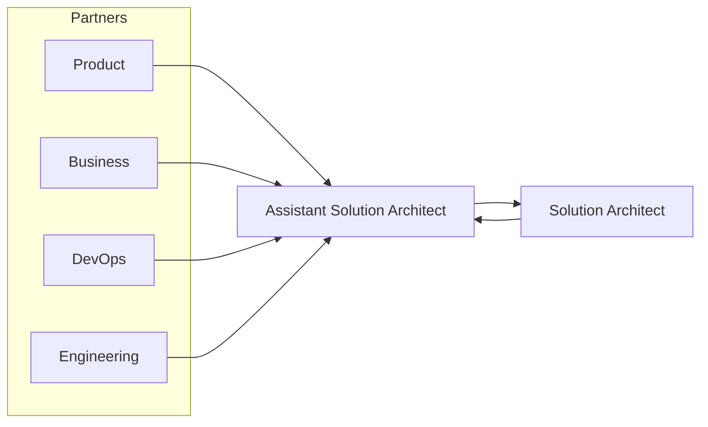

## One Decision, Three Conversations

When we chose to queue LLM work instead of calling the provider in the request path, I had three meetings that sounded unrelated:

- Product heard about loading states and retry UX
- DevOps heard about workers, autoscaling, and dead-letter queues
- Business heard about cost predictability and vendor blast radius

Same ADR. Different lenses. As Assistant Solution Architect, translation is not soft skills theater — it is how architecture lands.


> Translate NFRs into product language or they will be negotiated away as “edge cases.”

## Stakeholder Map for a Generic AI Assistant



I sit between partners and the Solution Architect: gather constraints, draft options, escalate multi-team bets.

## The Same Decision in Three Languages

**Engineering:** Accept chat messages synchronously; process model calls in a worker; stream tokens; enforce idempotent job ids; DLQ on poison messages.

**Product:** Users see “working” immediately; answers may arrive a moment later; failures show a clear retry instead of a blank spinner; citations remain visible when partial results exist.

**Business:** Token spend can be throttled per tenant; a provider outage does not take down the accept API; unit economics stay within the agreed range at projected volume.

When those three statements stay consistent, trust grows. When they diverge, someone was sold a fantasy.

## A Lightweight Brief I Reuse

```yaml
decision_brief:
  title: "Queue LLM calls"
  adr: "ADR-003"
  for_product:
    user_visible_change: "Explicit working state + retry"
    metrics: ["time_to_accept", "time_to_first_token", "retry_rate"]
  for_devops:
    new_components: ["worker", "queue", "dlq"]
    alerts: ["queue_depth", "dlq_rate", "worker_error_ratio"]
  for_business:
    cost_impact: "More predictable token throttling"
    risk_reduced: "Provider timeout no longer fails accept path"
    open_commercial: ["vendor SLA review"]
```

I paste the relevant section into each meeting invite. People arrive oriented.

## Facilitating Conflict Between Partners

Product wants richer prompts. FinOps wants shorter prompts. Both can be right at different loads. I bring the cost model and a proposed policy: default short template, optional “deep research” mode with a higher quota.

DevOps wants fewer moving parts. Engineering wants isolation. We timebox a spike instead of arguing identity.

The Solution Architect closes conflicts that cross budget or compliance. I make sure the conflict is framed with options, not personalities.

## Communication Anti-Patterns

- Sharing only the container diagram with executives
- Sharing only the roadmap slide with engineers
- Hiding risk until the week of launch
- Using latency percentiles with product and never defining what the user feels

## Code That Encodes a Product Promise

Sometimes the translation becomes a contract test:

```typescript
describe('chat accept path', () => {
  it('returns 202 even when the model provider is down', async () => {
    llmProvider.setDown(true);
    const res = await request(app).post('/chat').send(validBody);
    expect(res.status).toBe(202);
    expect(res.body.status).toBe('accepted');
  });
});
```

That test is a product promise with a CI badge.

## Related on This Site

Numbers behind the business lens: [NFRs, Effort, and Infrastructure Cost](/blog/nfrs-effort-and-infrastructure-cost). Developer-facing cadence: [Guiding Developers Without Being a Bottleneck](/blog/guiding-developers-without-being-a-bottleneck). Diagrams per audience: [C4 Diagrams for the Right Audience](/blog/c4-diagrams-for-the-right-audience).

Say the same truth three ways. That is how architecture becomes a team sport.
